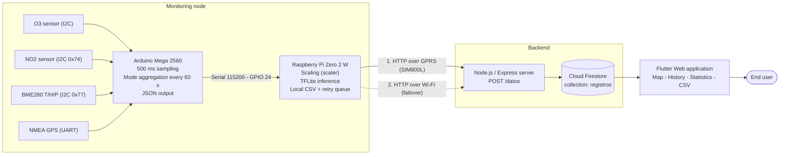
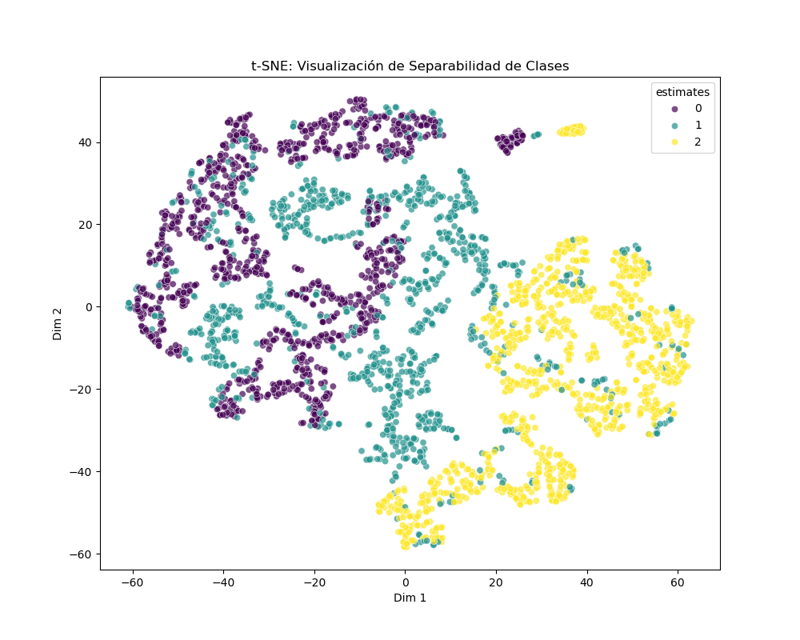

<div align="center">

# IoT System for NO₂ and O₃ Monitoring with Embedded Artificial Intelligence

**Universidad Técnica del Norte (UTN)**
Ibarra, Ecuador

[](https://www.arduino.cc/)
[](https://www.raspberrypi.com/)
[](https://www.tensorflow.org/lite)
[](https://flutter.dev/)
[](https://nodejs.org/)
[](https://firebase.google.com/)
[](#5-artificial-intelligence-model)

</div>

---

## Abstract

This repository contains the full development of a **low-cost air quality monitoring system** capable of measuring nitrogen dioxide (NO₂) and tropospheric ozone (O₃), classifying the air quality level through a **neural network executed locally on the device** (*Edge AI*), and publishing the georeferenced results on a **publicly accessible web platform**.

The system addresses three common limitations of conventional monitoring stations:

1. **Cost and coverage** — the design relies on low-cost instrumentation built around an Mega 2560 and a Raspberry Pi Zero 2 W.
2. **Connectivity dependence** — classification runs *at the edge*, so no cloud round trip is required to obtain a result, and transmission uses a redundant GPRS → Wi-Fi scheme with local storage and deferred retransmission (*store & forward*).
3. **Access to information** — data is exposed through a cross-platform web application with an interactive map, historical series, CSV export, and bilingual support (Spanish/English).

---

## Table of contents

- [1. System architecture](#1-system-architecture)
- [2. Repository structure](#2-repository-structure)
- [3. Hardware](#3-hardware)
- [4. Module description](#4-module-description)
- [5. Artificial intelligence model](#5-artificial-intelligence-model)
- [6. Data formats](#6-data-formats)
- [7. Installation and usage](#7-installation-and-usage)
- [8. Credential configuration](#8-credential-configuration)
- [9. Diagrams](#9-diagrams)
- [10. Results](#10-results)
- [11. Future work](#11-future-work)
- [12. Authorship and license](#12-authorship-and-license)

---

## 1. System architecture

The system follows a layered architecture: **acquisition → edge inference → redundant transmission → cloud persistence → visualization**.



**Data flow summary**

| Stage | Element | Rate | Output |
|---|---|---|---|
| Acquisition | Arduino Mega 2560 | 1 sample / 500 ms | Raw readings in buffer |
| Aggregation | Arduino Mega 2560 | 1 report / 60 s | JSON frame over serial port |
| Inference | Raspberry Pi Zero 2 W | Per frame | Class 0, 1 or 2 |
| Transmission | SIM800L (GPRS) / Wi-Fi | Per frame | HTTP POST |
| Persistence | Node.js + Firestore | Per POST | Document with `GeoPoint` |
| Visualization | Flutter Web | On demand | Map, charts and CSV |

---

## 2. Repository structure

```
Sistema_IoT_Monitoreo_NO2_O3_UTN/
│
├── CodigosDispositivo/
│   ├── ArduinoMega/
│   │   └── DataCollectionAIQ.ino        Sensor acquisition and aggregation firmware
│   ├── RaspberryPiZero2W/
│   │   ├── back.py                      Main program: inference + redundant telemetry
│   │   ├── locall.py                    Local-network testing variant
│   │   ├── envio.py                     SIM800L modem driver (AT commands / HTTP)
│   │   ├── modelo_red.tflite            Model deployed on the device
│   │   ├── scaler.pkl                   Scaler fitted during training
│   │   └── registros.csv                Local historical log (data logging)
│   └── ServidorNode/sim800server/
│       ├── index.js                     REST API that receives telemetry and writes to Firestore
│       └── package.json
│
├── Red_Neuronal/
│   ├── datasetAIQ.csv                   Training dataset (3,270 samples)
│   ├── Preprocesamiento.ipynb           Exploratory analysis, class balance and t-SNE
│   ├── Entrenamiento.ipynb              Model definition, training and evaluation
│   ├── Conversion.ipynb                 Keras (.h5) to TensorFlow Lite conversion
│   ├── modelo_red.h5 / modelo_red.tflite
│   ├── scaler.pkl
│   └── tsne_plot.png                    Class separability visualization
│
├── Pagina_Web/flutter_web_aiq/          Flutter application (web, Android, iOS, desktop)
│   └── lib/
│       ├── config/                      Routing (Fluro), es/en localization and services
│       ├── infrastructure/              Datasources (Firestore, geocoding) and mappers
│       └── presentation/                Pages, providers and widgets
│
└── Diagramas/                           Editable diagrams in draw.io format
    ├── DiagramadeFLujoPrincipalV2.drawio
    ├── DiagramaDeFlujoEntrenamientoModelo.drawio
    └── DiagramaDeSecuencia.drawio
```

---

## 3. Hardware

| Component | Model / Reference | Interface | Function |
|---|---|---|---|
| Microcontroller | Arduino Mega 2560 | — | Sensor acquisition and preprocessing |
| Embedded computer | Raspberry Pi Zero 2 W | — | Model inference and telemetry |
| Ozone sensor | DFRobot Gravity O₃ | I2C (`OZONE_ADDRESS_3`) | O₃ concentration in ppb |
| NO₂ sensor | DFRobot Gravity Multigas NO₂ | I2C (`0x74`) | NO₂ concentration in ppm |
| Environmental sensor | BME280 | I2C (`0x77`) | Temperature, humidity, pressure and altitude |
| GPS receiver | NMEA module (`$GPRMC` / `$GNRMC`) | UART (`Serial1`, 9600 bps) | Georeferencing of each measurement |
| Cellular modem | SIM800L | UART (`/dev/serial0`, 9600 bps) | GPRS transmission |

**Operating notes**

- The firmware performs a **5-minute warm-up** before starting sampling, a stabilization requirement of the electrochemical sensors.
- Arduino → Raspberry Pi communication uses **software serial reading (bit-banging) with `pigpio`** on GPIO 24, which avoids conflicts with the UART reserved for the SIM800L modem.
- If the GPS does not achieve a valid fix, the default installation-site coordinates defined in the firmware are used.

---

## 4. Module description

### 4.1 Firmware — `CodigosDispositivo/ArduinoMega/DataCollectionAIQ.ino`

Acquires the four input variables of the model along with the GPS position. To reduce the noise typical of low-cost sensors, **one sample is taken every 500 ms** and, once the **60-second window (120 samples)** is complete, the **mode** of each variable is computed — with a quantization step of 0.01 for NO₂ and 0.1 for temperature and humidity — before emitting the JSON frame over the serial port.

### 4.2 Edge node — `CodigosDispositivo/RaspberryPiZero2W/back.py`

Main program running on the device. Its responsibilities are:

- **Serial reading** of the stream coming from the Arduino and reassembly of complete JSON frames.
- **Local inference**: scales the `[no2, ozone, temperature, humidity]` vector with `scaler.pkl` and runs `modelo_red.tflite` through `tflite_runtime`, obtaining the class via `argmax`.
- **Local logging**: every measurement is appended to `registros.csv`, guaranteeing traceability even without connectivity.
- **Redundant telemetry**: attempts delivery over **GPRS (SIM800L)** and, on failure, automatically switches to **Wi-Fi**.
- **Store & forward**: if both channels fail, the record is queued in `pendientes.json` and retried after the next successful transmission; once the queue is drained, the file is removed.

> `locall.py` is an equivalent variant intended for testing against a local-network server.

### 4.3 Modem driver — `envio.py`

Encapsulates the `Sim800L` class, which manages the full AT command cycle: GPRS bearer activation (`AT+SAPBR`), HTTP configuration (`AT+HTTPINIT`, `AT+HTTPPARA`), JSON body upload (`AT+HTTPDATA`) and POST execution (`AT+HTTPACTION=1`), validating the `+HTTPACTION: 1,200` response.

### 4.4 Server — `CodigosDispositivo/ServidorNode/sim800server/index.js`

REST API built with **Express** and the **Firebase Admin SDK**. It exposes `POST /datos`, validates the presence of coordinates, builds a Firestore `GeoPoint`, and persists the document in the `registros` collection using the `timestamp` as the document ID, which guarantees **idempotency** against duplicate resends coming from the pending queue.

### 4.5 Web application — `Pagina_Web/flutter_web_aiq/`

Flutter application with a layered architecture (`config` / `infrastructure` / `presentation`), routing with **Fluro**, state management with **Provider**, and dependency injection with **GetIt**. Features:

| View | Route | Description |
|---|---|---|
| **Map** | `/map` | OpenStreetMap map (`flutter_map`) with animated markers per measurement point, grouping of nearby records, and date selection. Supports deep linking to a marker: `/map/marker/:day/:month/:year/:lat/:lng`. |
| **Measurements** | `/history` | Time series with `fl_chart`, trend cards, a detailed per-device table, and reverse geocoding of the sampling point. |
| **Resources** | `/resources` | Export of the records for a single day or a date range to a downloadable **CSV** file. |

It also implements **Spanish/English internationalization** switchable at runtime (see `lib/config/localization/README_LOCALIZATION.md`).

---

## 5. Artificial intelligence model

### 5.1 Dataset

`Red_Neuronal/datasetAIQ.csv` — **3,270 samples**, `;` separator, four predictor variables and one target variable:

| Column | Description | Unit |
|---|---|---|
| `no2` | Nitrogen dioxide concentration | ppm |
| `ozone` | Tropospheric ozone concentration | ppb |
| `temperature` | Ambient temperature | °C |
| `humidity` | Relative humidity | % |
| `estimates` | Air quality class (target) | 0 / 1 / 2 |

### 5.2 Output classes

| Class | Label | Interpretation |
|:---:|---|---|
| `0` | **Good** | Satisfactory air quality; no associated risk. |
| `1` | **Moderate** | Acceptable; minor effects possible for sensitive individuals. |
| `2` | **Unhealthy for sensitive groups** | Risk for sensitive populations; prolonged exposure should be limited. |

### 5.3 Network architecture

```
Input (4 features)
        ↓
Dense(64, ReLU)  →  Dropout(0.2)
        ↓
Dense(32, ReLU)  →  Dropout(0.2)
        ↓
Dense(3, Softmax)
```

| Hyperparameter | Value |
|---|---|
| Optimizer | Adam |
| Loss function | `categorical_crossentropy` |
| Max epochs / batch size | 100 / 32 |
| Split | 80 % training — 20 % test (`random_state=42`), with a 20 % internal validation split |
| Scaling | `StandardScaler` (persisted in `scaler.pkl`) |
| Regularization | `Dropout(0.2)` + `EarlyStopping(patience=10, restore_best_weights=True)` |
| Dynamic tuning | `ReduceLROnPlateau(factor=0.5, patience=5, min_lr=1e-6)` |

### 5.4 Training results

| Metric | Value |
|---|---|
| **Test set accuracy** | **97.40 %** |
| Test loss | 0.076 |
| Early stopping epoch | 78 (best weights restored from epoch 68) |
| Deployed model | `modelo_red.tflite` |

### 5.5 Reproducing the training

Run the notebooks in the following order:

1. `Preprocesamiento.ipynb` — exploration, class balance verification, and t-SNE projection.
2. `Entrenamiento.ipynb` — training, evaluation, confusion matrix, and learning curves; generates `modelo_red.h5` and `scaler.pkl`.
3. `Conversion.ipynb` — conversion to `modelo_red.tflite` for deployment on the Raspberry Pi.

> After regenerating the model, copy **`modelo_red.tflite` and `scaler.pkl`** to `CodigosDispositivo/RaspberryPiZero2W/`. Both files must come from the same training run: using a scaler that does not match the model invalidates inference.

---

## 6. Data formats

### 6.1 Arduino → Raspberry Pi frame (serial port)

```json
{"NO2":0.01,"O3":175,"temp":25.20,"hum":44.30,"lat":0.358930,"lon":-78.111214}
```

### 6.2 `POST /datos` body (Raspberry Pi → server)

```json
{
  "no2": 0.01,
  "o3": 175.0,
  "temperatura": 25.2,
  "humedad": 44.3,
  "prediccion": 2,
  "timestamp": 1764880210,
  "latitud": 0.35893,
  "longitud": -78.111214
}
```

### 6.3 Firestore document — `registros` collection

| Field | Type | Notes |
|---|---|---|
| *(document ID)* | `string` | Equal to the UNIX `timestamp` in seconds |
| `no2` | `number` | ppm |
| `o3` | `number` | ppb |
| `temperatura` | `number` | °C |
| `humedad` | `number` | % |
| `prediccion` | `number` | 0, 1 or 2 |
| `timestamp` | `number` | UNIX seconds |
| `ubicacion` | `GeoPoint` | Latitude and longitude of the measurement |

---

## 7. Installation and usage

### 7.1 Prerequisites

| Component | Minimum version |
|---|---|
| Arduino IDE | 2.x |
| Python (Raspberry Pi OS) | 3.11 |
| Node.js | 18 LTS |
| Flutter SDK | Dart `^3.5.4` |

### 7.2 Arduino Mega firmware

Install from the Arduino IDE Library Manager:

- `DFRobot_OzoneSensor`
- `DFRobot_MultiGasSensor`
- `DFRobot_BME280`

Open `CodigosDispositivo/ArduinoMega/DataCollectionAIQ.ino`, select the **Arduino Mega 2560** board, and upload the sketch. The serial monitor at **115200 baud** should print `Ozone OK`, `NO2 OK`, and `BME280 OK`, followed by the warm-up period.

### 7.3 Raspberry Pi Zero 2 W node

```bash
sudo apt update
sudo apt install -y python3-pip pigpio
pip3 install pandas numpy joblib scikit-learn requests pyserial pigpio tflite-runtime

# The pigpio daemon must run with a 10 us sample rate
sudo pigpiod -s 10

cd CodigosDispositivo/RaspberryPiZero2W
python3 back.py
```

Before the first run, update the `SERVER_URL_WIFI` constant in `back.py` and the `apn` and `server` attributes of the `Sim800L` class in `envio.py` with your own carrier and backend values.

### 7.4 Node.js server

```bash
cd CodigosDispositivo/ServidorNode/sim800server
npm install
npm start          # Listens on port 3000 (or the one defined in process.env.PORT)
```

Quick endpoint test:

```bash
curl -X POST http://localhost:3000/datos \
  -H "Content-Type: application/json" \
  -d '{"no2":0.01,"o3":175,"temperatura":25.2,"humedad":44.3,"prediccion":2,"timestamp":1764880210,"latitud":0.35893,"longitud":-78.111214}'
```

### 7.5 Web application

```bash
cd Pagina_Web/flutter_web_aiq
flutter pub get
flutter run -d chrome              # Development mode
flutter build web --release        # Production build -> build/web
```

The application requires the `lib/firebase_options.dart` file, which is **not versioned**. Generate it with:

```bash
dart pub global activate flutterfire_cli
flutterfire configure
```

---

## 8. Credential configuration

The system depends on Firebase credentials that **must not be published in the repository**:

| File | Module | How to obtain it |
|---|---|---|
| `lib/firebase_options.dart` | Flutter application | `flutterfire configure` |
| `android/app/google-services.json` | Android build | Firebase Console → Project settings |
| `<project>-firebase-adminsdk-*.json` | Node.js server | Firebase Console → Service accounts → *Generate new private key* |

On the server, the path to the service account file is declared in `index.js`. Loading it from an environment variable (`GOOGLE_APPLICATION_CREDENTIALS`) instead of referencing the file directly is recommended, along with keeping a root `.gitignore` that excludes:

```gitignore
# Credentials
**/*firebase-adminsdk*.json
**/google-services.json
**/GoogleService-Info.plist
**/firebase_options.dart

# Dependencies and build artifacts
node_modules/
__pycache__/
build/
.dart_tool/
pendientes.json
```

---

## 9. Diagrams

The `Diagramas/` folder contains the editable schematics of this work in **draw.io** format (`.drawio`), which can be opened at [app.diagrams.net](https://app.diagrams.net) or with the *Draw.io Integration* extension for VS Code:

| File | Content |
|---|---|
| `DiagramadeFLujoPrincipalV2.drawio` | Main system operation flowchart |
| `DiagramaDeFlujoEntrenamientoModelo.drawio` | Model training and conversion process |
| `DiagramaDeSecuencia.drawio` | Interaction sequence between node, server and application |

---

## 10. Results

- **Classification**: 97.40 % accuracy on the test set, with a generalization gap kept under control through dropout and early stopping.
- **Class separability**: the t-SNE projection generated in `Preprocesamiento.ipynb` shows distinguishable clusters among the three air quality categories.

<div align="center">
  
</div>

- **Operational continuity**: the *store & forward* scheme preserves the record during coverage outages and synchronizes pending data once the link is restored.
- **Edge inference**: the TensorFlow Lite model runs entirely on the Raspberry Pi Zero 2 W, with no dependence on external services to obtain a classification.

---

## 11. Future work

- Cross-calibration of the sensors against a certified reference station.
- Dataset expansion with local measurements from an extended field campaign.
- Inclusion of particulate matter (PM2.5 / PM10) as an additional model variable.
- Autonomous power supply through a solar panel with battery management.
- Deployment of a multi-node network with device identification and spatial comparison.
- Authentication and Firestore security rules to restrict record writes.

---
